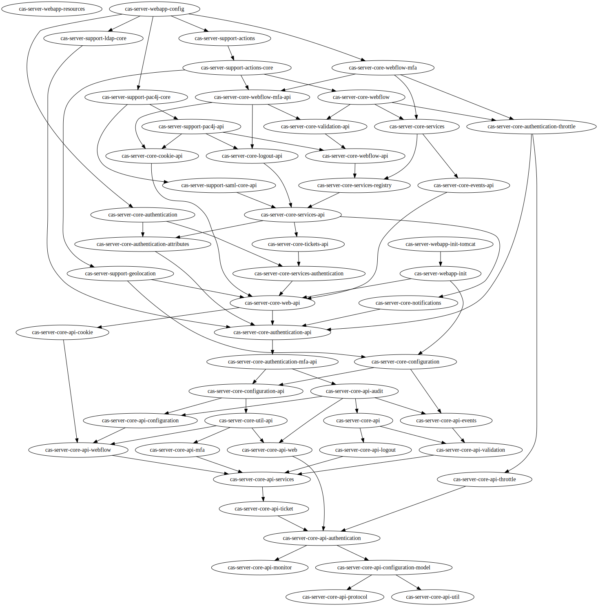

# 序言
CAS有众多模块，部分模块的关系如下图：

## 模块命名方式
### 模块分类
根据模块名的前缀可分为大致三类：
1. cas-server-core
2. cas-server-webapp
3. cas-server-support

### api
众多模块中，有不少都带有api字样。且xxx-api与api-xxx这种共存的还比较多，发现通常api-xxx是一些接口的定义，而xxx-api则是其具体实现。  
例如：
1. api-authentication 与 authentication-api
2. api-web 与 web-api
3. api-ticket 与 tickets-api
4. api-configuration 与 configuration-api
5. api-services 与 services-api

### cas-server-core-xxx
cas-server-core-xxx一般是一些默认配置（通常需要对其进行覆盖配置以达到生产使用CAS的目的），例如：
1. cas-server-core
2. cas-server-core-audit
3. cas-server-core-authentication
4. cas-server-core-configuration
5. cas-server-core-cookie
6. cas-server-core-logging
7. cas-server-core-logout
8. cas-server-core-notification
9. cas-server-core-services
10. cas-server-core-tickets
11. cas-server-core-validation
12. cas-server-core-web
13. cas-server-core-webflow
