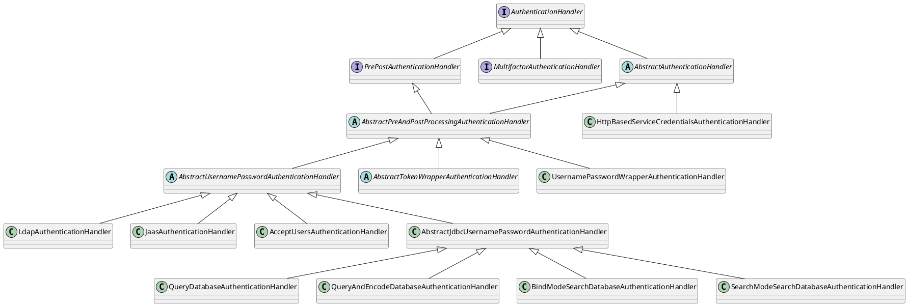

# AuthenticationHandler

## AuthenticationHandler
状态STATE，不是ACTIVE的将不会被启用  
名称name，默认为类名  
ORDER 用于链式处理的顺序，默认最低Integer.MAX_VALUE  
boolean supports(final Credential credential) 是否适用于某种Credential  
还有一个核心的认证方法 authenticate(Credential credential, Service service)

Bad password: javax.security.auth.login.FailedLoginException
Expired password: javax.security.auth.login.CredentialExpiredException
User account expired: javax.security.auth.login.AccountExpiredException
User account locked: javax.security.auth.login.AccountLockedException
User account not found: javax.security.auth.login.AccountNotFoundException
Time of authentication not allowed: org.apereo.cas.authentication.InvalidLoginTimeException
Location of authentication not allowed: org.apereo.cas.authentication.InvalidLoginLocationException
Expired X.509 certificate: java.security.cert.CertificateExpiredException

## PrePostAuthenticationHandler
增加pre和post方法，可做些拦截

## AbstractAuthenticationHandler
就加了些字段及构造器。其中：

| 字段                           | 含义                          |
|------------------------------|-----------------------------|
| PrincipalFactory             | 来创建认证成功后的Principal          |
| ServicesManager              | 来获取认证方法中的Service参数          |
| credentialSelectionPredicate | 用于简单支持support方法             |
| name&order&state             | AuthenticationHandler中定义的字段 |

## AbstractPreAndPostProcessingAuthenticationHandler
PrePostAuthenticationHandler的轻量实现，  
定义了PrePostAuthenticationHandler的模板实现：authenticate = preAuthenticate + doAuthentication + postAuthenticate  
其子类则需要实现doAuthentication方法

## AbstractUsernamePasswordAuthenticationHandler
常见的用户名&密码认证

| 字段                                           | 含义                                                                                      |
|----------------------------------------------|-----------------------------------------------------------------------------------------|
| AuthenticationPasswordPolicyHandlingStrategy |                                                                                         |
| PasswordEncoder                              | 用于密码加密码及校验（通常用户输入后的密码与数据库里保存的密码进行校验）                                                    |
| PrincipalNameTransformer                     | 将登录框中输入的用户名进行转换，以供查询。但这个转换不影响真正的值？可用于以学号登录的场景：比如学号是scu114113，则用户也可直接使用114113登录？比如转换大小写？ |
| PasswordPolicyContext                        | 用于密码过期提醒的                                                                               |
这里也定义了doAuthentication的模板实现：doAuthentication = transformUsername + transformPassword + authenticateUsernamePasswordInternal  
其子类则需要实现authenticateUsernamePasswordInternal方法
> authenticateUsernamePasswordInternal方法参数有点怪怪的，即带有encode后的密码，也带有原始的密码。

## AbstractJdbcUsernamePasswordAuthenticationHandler
增加了三个属性。DataSource、JdbcTemplate、NamedParameterJdbcTemplate。
核心在于DataSource，通过DataSource来连接数据库，同时用DataSource创建JdbcTemplate、NamedParameterJdbcTemplate来进行查询以供用户名&密码校验

AbstractJdbcUsernamePasswordAuthenticationHandler自带了以下四个实现：
### QueryDatabaseAuthenticationHandler
通过sql查出密码并与用户输入的密码进行对比（使用PasswordEncoder）。配置信息位于 QueryJdbcAuthenticationProperties。  
sqk查询sql，必须配置。类似于： `SELECT * FROM user WHERE user_name=?`。如果sql中有?，则使用JdbcTemplate，否则使用NamedParameterJdbcTemplate（但这里的参数名限制为username, password，也有点死了）  
fieldPassword数据库中密码字段名称，必须配置。  
fieldExpired密码是否过期字段，这里限制有点死，如果DB里存的是过期时间，这个字段就没法直接用了，但可以考虑修改sql以适用。 类似于 `SELECT password, pass_expire_time > now() as pass_expired FROM user WHERE user_name=?`  
fieldDisabled账户是否被禁用字段，这里限制有点死，如果DB里存的是状态枚举，这个字段就没法直接用了，但可以考虑修改sql以适用。类似于 `SELECT password, user_state == 9 as disabled FROM user WHERE user_name=?`  
principalAttributeList 用户属性字段  
总体来说还是可以用的，另外如果是通过邮箱登录的话，也可以考虑在这里直接将Principal转换为用户名，就不用PrincipalResolver了。
### QueryAndEncodeDatabaseAuthenticationHandler
通过sql查出密码并与用户输入的密码进行对比（使用PasswordEncoder+DefaultHashService）。配置信息位于 QueryEncodeJdbcAuthenticationProperties。
限制比较大，DB表中需要存储公盐（以及可选的加密迭代次数），并通过 `org.apache.shiro.crypto.hash.DefaultHashService.DefaultHashService` 进行加密。
公盐可公开，为动态盐，不影响安全性；私盐不可公开，为静态盐。  
由于DB中需要以字段的形式存储公盐，因此不太实用。公盐与密码字段融为一体，密码字段的一部分用于保存公盐（前面、后面、中间）
### BindModeSearchDatabaseAuthenticationHandler
不实用，实际上是验证DB的用户名&密码。
### SearchModeSearchDatabaseAuthenticationHandler
通过用户名及密码去DB里查，查到了则认为成功。

## 其它
HttpBasedServiceCredentialsAuthenticationHandler 似乎是代理到另一个CAS Server做认证？
UsernamePasswordWrapperAuthenticationHandler 跟pac4j有关，还不太清楚
AbstractTokenWrapperAuthenticationHandler 也是跟pac4j有关
LdapAuthenticationHandler 通过LDAP（轻型目录访问协议 ）进行认证
JaasAuthenticationHandler 通过JAAS（Java认证和授权服务）进行认证