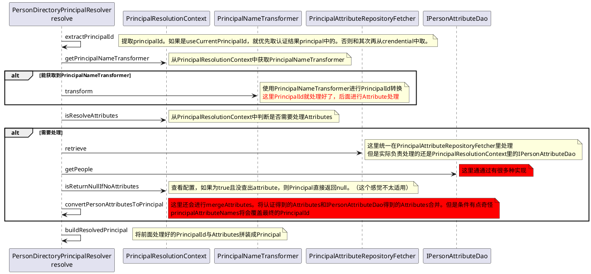

# PersonDirectoryPrincipalResolver
比较实用的一种实现，可进行Principal的id及属性处理。内有PrincipalResolutionContext，核心的resolve方法就是由这个PrincipalResolutionContext去实现的。
## PrincipalResolutionContext

| 属性                                   | 含义                                       |
|--------------------------------------|------------------------------------------|
| IPersonAttributeDao                  | 获取用户属性                                   |
| PrincipalFactory                     | 用以创建Principal                            |
| returnNullIfNoAttributes             | 如果没有Attributes，连Principal也返回null         |
| principalNameTransformer             | 用以转换PrincipalId的                         |
| principalAttributeNames              | 逗号分隔的属性名称，这部分字段如果查到数据会覆盖PrincipalId      |
| useCurrentPrincipalId                | 生成Principal时，是否优先取当前认证后Principal的id      |
| resolveAttributes                    | 是否处理Attributes                           |
| activeAttributeRepositoryIdentifiers | 激活的RepositoryId，跟 IPersonAttributeDao 有关 |
| IAttributeMerger                     | 用以合并用户属性，但合并的条件有点奇怪                      |

