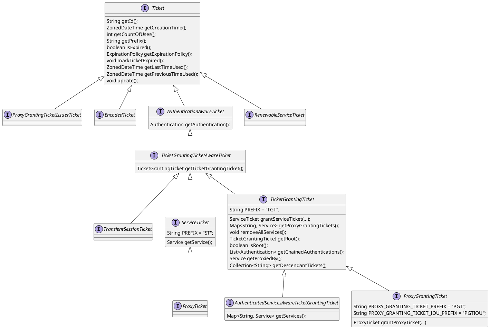

# cas-server-core-api-ticket
## Ticket
登录态的证明。通常在Web登录流程中，登录后后台会在TicketRegistry中保存这个Ticket，前端则是会存在Cookie中，再下访问前端将这个Cookie带到后端进行验证。

1. Ticket。主要定义了id、前缀、创建时间、使用时间、使用次数、过期、前缀属性，同时有个update()方法可对使用时间及次数进行更新。
2. AuthenticationAwareTicket。可获取Authentication，而Authentication算是CAS登录的核心。CAS认证成功后会生成Authentication，会凭此生成Ticket（TGT）。
3. TicketGrantingTicketAwareTicket。TGT与ST的上层抽象，因为ST也是由TGT签发。
4. TicketGrantingTicket。简称TGT，CAS里的全局登录票据，表明全局登录，可以凭此签发针对Service（子系统）的ST。这里还设计成了继承结构。
5. AuthenticatedServicesAwareTicketGrantingTicket。用以记录对哪些Service签发了ST。
6. ServiceTicket。简称ST，CAS里的子系统登录票据，表明子系统登录。

## TicketFactory
没啥特别的内容，就是以工厂模式创建Ticket。
## TicketRegistry
提供一系列的Ticket管理能力。如：addTicket, getTicket, updateTicket, count等。
```plantuml
interface TicketRegistry {
    void addTicket(Ticket ticket);
    default void addTicket(final Stream<? extends Ticket> toSave);
    <T extends Ticket> T getTicket(String ticketId, Class<T> clazz);
    Ticket getTicket(String ticketId);
    Ticket getTicket(String ticketId, Predicate<Ticket> predicate);
    int deleteTicket(String ticketId)
    int deleteTicket(Ticket ticketId)
    long deleteAll();
    Collection<? extends Ticket> getTickets();
    default Stream<? extends Ticket> getTickets(final Predicate<Ticket> predicate);
    Ticket updateTicket(Ticket ticket);
    long sessionCount();
    long serviceTicketCount();
    long countSessionsFor(String principalId);
    ...()
}
```

## TicketRegistrySupport
主要提供获取TicketRegistry、通过ticketId获取Ticket/Authentication/Principal的方法。  
最终实现估计还是通过TicketRegistry完成的。

## ServiceTicketSessionTrackingPolicy
将TGT为哪个Service签发了ST记录下来。至少应该做以下两件事：
1. 更新TGT的使用时间、使用次数
2. 更新TGT保存的Service信息 `Map<String, Service> getServices();`

## ExpirationPolicy
Ticket的过期策略。用以判断Ticket是否过期、查询过期时间等。
```plantuml
interface ExpirationPolicy {
    boolean isExpired(TicketGrantingTicketAwareTicket ticketState);
    Long getTimeToLive();
    Long getTimeToIdle();
    String getName();
}
```