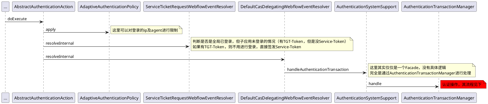
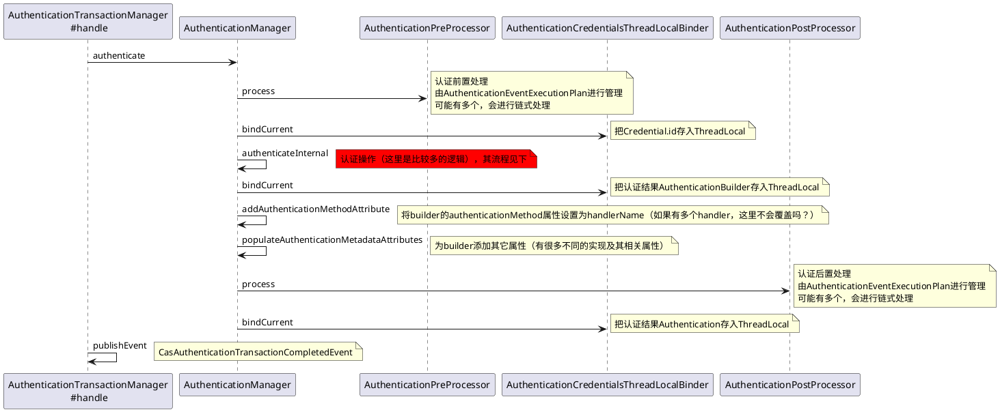
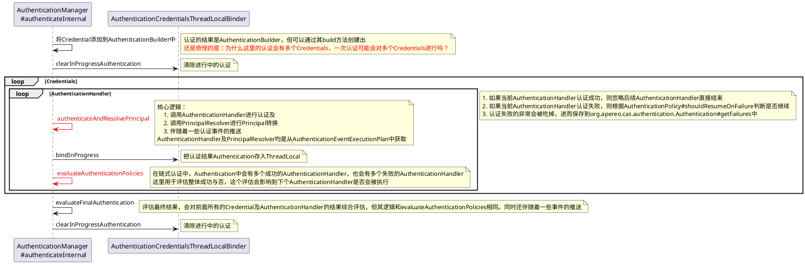
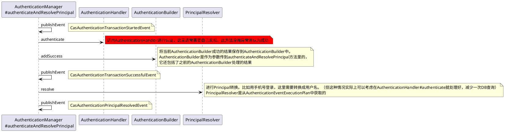

# 登录流程
CAS Server采用了Spring Webflow的方式集成登录，其入口在于AbstractAuthenticationAction的doExecute方法。

一个AuthenticationHandler认证失败没有事件吗？

| 事件                                          | 说明                                              |
|---------------------------------------------|-------------------------------------------------|
| CasAuthenticationTransactionStartedEvent    | 一个AuthenticationHandler认证的开始                    |
| CasAuthenticationTransactionSuccessfulEvent | 一个AuthenticationHandler认证成功                     |
| CasAuthenticationPrincipalResolvedEvent     | 一个AuthenticationHandler认证成功并进行了PrincipalResolve |
| CasAuthenticationTransactionFailureEvent    | 一次认证失败。所有的Handler均为失败                           |
| CasAuthenticationPolicyFailureEvent         | 一次认证失败。所有Handler的结果经评估后为失败                      |
| CasAuthenticationTransactionCompletedEvent  | 一次认证的结束                                         |
