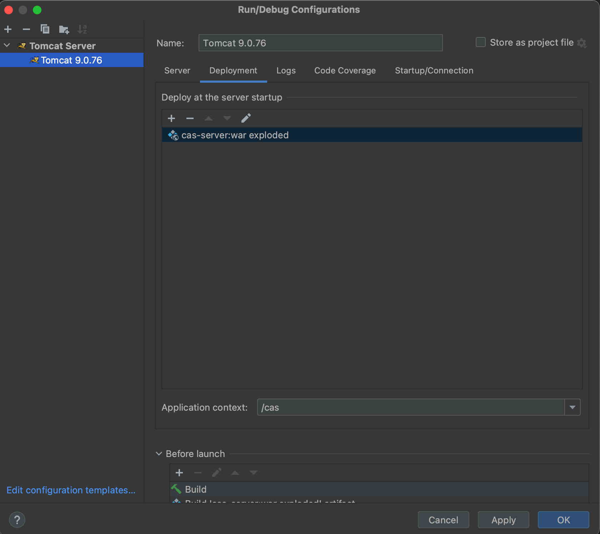
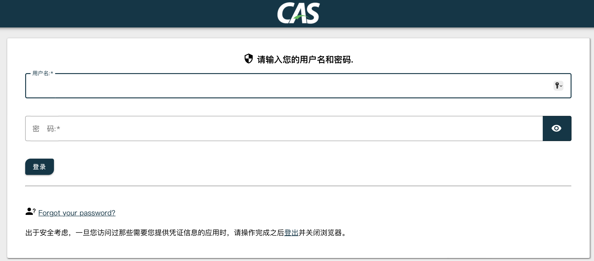

# CAS服务端初始化创建

## 环境
```
JDK 11
CAS 6.6.9
```

## 搭建
1. 创建maven项目（略）
2. pom.xml中指定以下内容
   ```xml
   <?xml version="1.0" encoding="UTF-8"?>
   <project xmlns="http://maven.apache.org/POM/4.0.0"
            xmlns:xsi="http://www.w3.org/2001/XMLSchema-instance"
            xsi:schemaLocation="http://maven.apache.org/POM/4.0.0 http://maven.apache.org/xsd/maven-4.0.0.xsd">
       <modelVersion>4.0.0</modelVersion>
   
       <groupId>ink.akira</groupId>
       <artifactId>cas-server</artifactId>
       <version>1.0-SNAPSHOT</version>
       <packaging>war</packaging>
   
       <properties>
           <maven.compiler.source>11</maven.compiler.source>
           <maven.compiler.target>11</maven.compiler.target>
           <project.build.sourceEncoding>UTF-8</project.build.sourceEncoding>
           <cas.version>6.6.9</cas.version>
       </properties>
   
       <dependencies>
           <dependency>
               <groupId>org.apereo.cas</groupId>
               <artifactId>cas-server-webapp-tomcat</artifactId>
               <version>${cas.version}</version>
               <type>war</type>
           </dependency>
       </dependencies>
   
       <build>
           <plugins>
               <plugin>
                   <artifactId>maven-war-plugin</artifactId>
                   <version>2.6</version>
                   <configuration>
                       <warName>cas</warName>
                       <failOnMissingWebXml>false</failOnMissingWebXml>
                       <overlays>
                           <overlay>
                               <groupId>org.apereo.cas</groupId>
                               <artifactId>cas-server-webapp-tomcat</artifactId>
                           </overlay>
                       </overlays>
                   </configuration>
               </plugin>
           </plugins>
       </build>
   
   </project>
   ```
   **CAS的所有内容都在cas-server-webapp-tomcat这个overlay中，先引用这个war然后再对其具体内容进行修改。**
3. 在idea中配置tomcat并启动
   
4. 访问并登录。 `http://localhost:8080/cas` ，默认用户名：casuser，默认密码：Mellon。
      