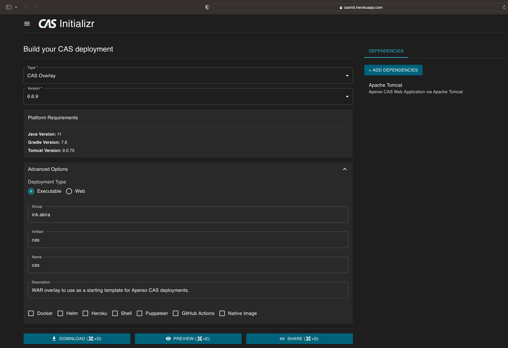
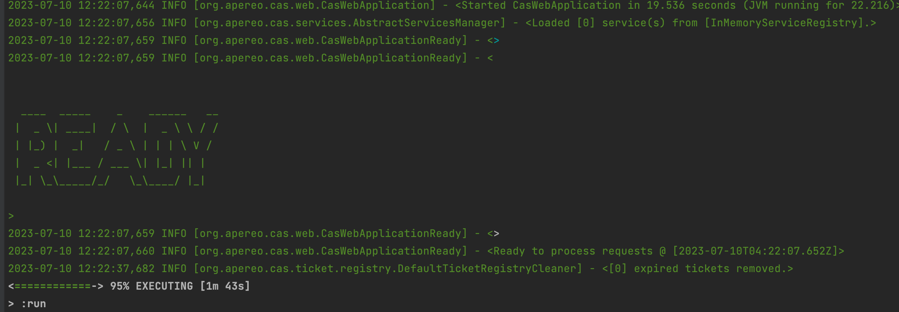

# 使用CAS Initializr创建CAS服务端
## 创建步骤
CAS官方提供并推荐使用CAS Initializr来初始创建CAS服务端。步骤如下：
1. 在线生成项目。网址：https://casinit.herokuapp.com/ui
    
2. 配置调整。 下载后使用idea打开，在 `application.yml` 中添加如下配置
    ```
    # 开发环境可以先关闭ssl
    server:
      ssl:
        enabled: false
    ```
3. 启动项目。在Idea的Terminal控制台直接通过以下命令启动
    ```
    ./gradlew clean run
    ```
   得到像如下的输出就表示成功了：
   
4. 访问并登录。 `http://localhost:8443/cas` ，默认用户名：casuser，默认密码：Mellon。
   

## 说明
1. 这种方式生成的是较新版本的CAS，因此对JDK等环境要求也较高
2. 默认使用的是Gradle构建，而非Maven，没用过Gradle的话会多一些学习成本。

# 参考
1. https://apereo.github.io/cas/6.6.x/installation/WAR-Overlay-Initializr.html