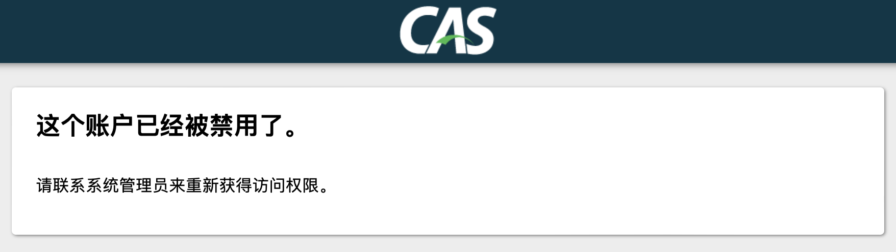
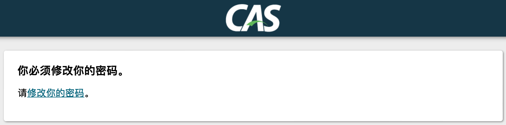

# 用户状态&密码过期校验
由于前面用的是QueryDatabaseAuthenticationHandler，自带了用户状态&密码过期校验，因此这里直接使用。

## 改造步骤
1. 修改 `applicaiton.yml`
    ```yaml
    cas:
      authn:
        jdbc:
          query[0]:
            # 指定密码过期、用户状态字段
            field-disabled: user_status_disabled
            field-expired: pwd_expired
            # sql也需要同步修改
            sql: select password, password_expire_time is not null and password_expire_time < now() as pwd_expired, user_status = 2 as user_status_disabled from user_base where user_name = ?;
            # other configs ignored
    ```
2. 验证
   1. 帐户禁用后登录
      
   2. 密码过期后登录
      

## 其它
这里是通过跳转提示页面来做的，可以考虑做成交互式的提示，比如仅仅出个弹窗。其实其它部分都没采用交互式响应，涉及到前端改造，这里先搁置。