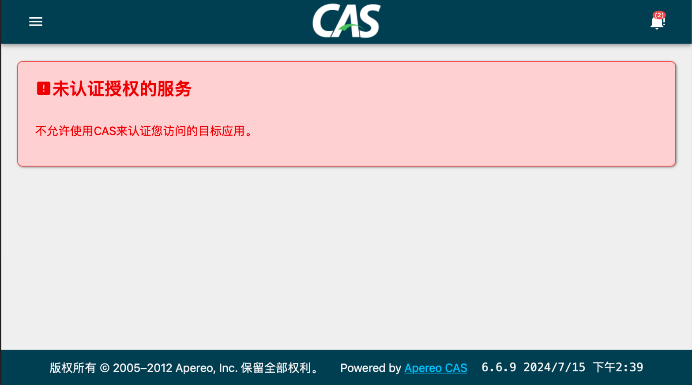

# CAS服务管理（json文件）
这里的服务管理指的是对CAS Client的管理，包括但不限于以下方面：
1. 授权哪些应用使用CAS Server进行登录
2. 每个Client各自使用的策略，比如可使用哪些AuthenticationHandler

如果CasClient没有被CasServer管理，那访问时就会遇到：


这里就简单介绍如何允许哪些CasClient进行集成。

## 配置步骤
### 1. 启用json配置
```xml
<dependency>
    <groupId>org.apereo.cas</groupId>
    <artifactId>cas-server-support-json-service-registry</artifactId>
    <version>${cas.version}</version>
</dependency>
```
### 2. 配置应用
vim /resources/services/dev-9000.json
```json
{
  "@class": "org.apereo.cas.services.CasRegisteredService",
  "serviceId": "^https?://localhost:8080/.*",
  "name": "dev",
  "id": 9000,
  "description": "本地开发",
  "evaluationOrder": 9000
}
```

如果有多个CasClient客户端，配置多个文件即可。


## 参考
https://apereo.github.io/cas/6.6.x/services/JSON-Service-Management.html
