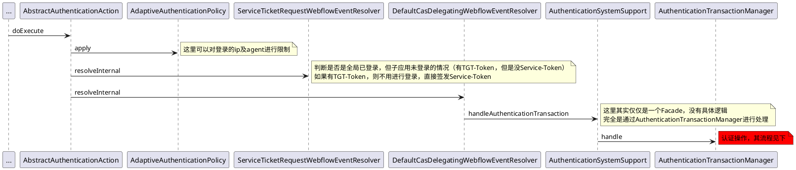
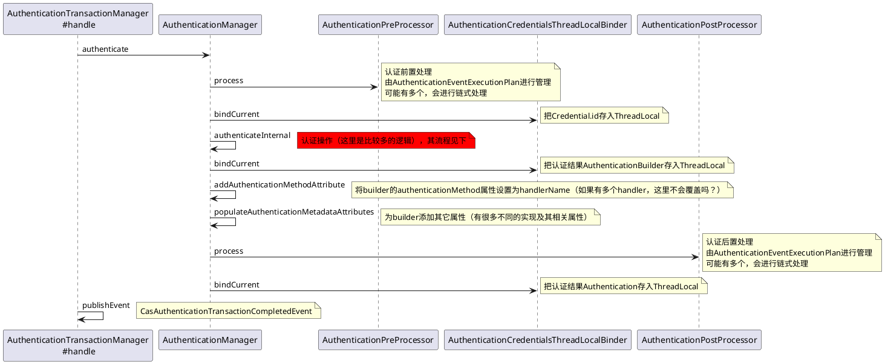
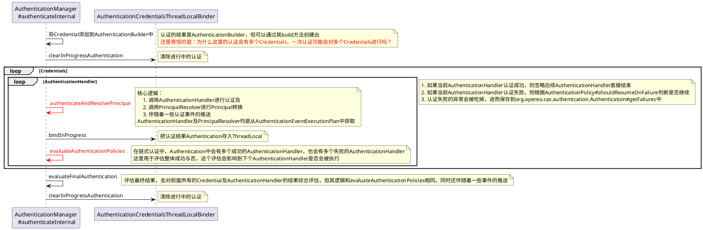
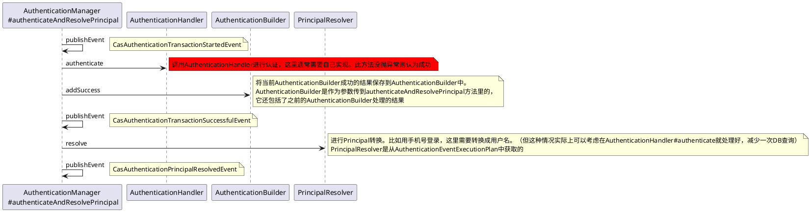
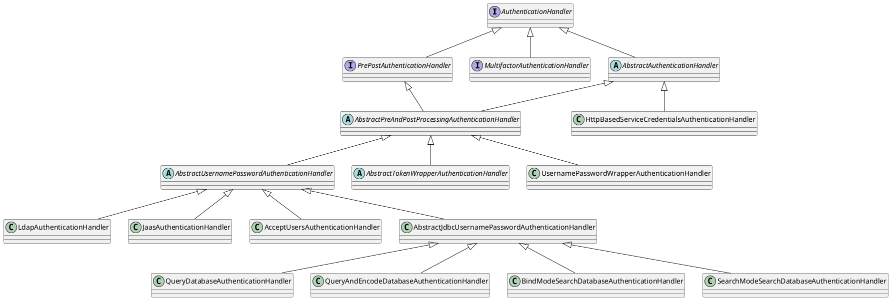

# 基本概念
## Credential
Credential 简单理解为认证的主体，即通过什么方式来认证。比如：用户名+密码，手机号+验证码，Token等。

org.apereo.cas.configuration.model.core.authentication.AuthenticationPolicyProperties.sourceSelectionEnabled

UsernamePasswordCredential带有source字段，设计目的在于可根据不同的source来选择不同的AuthenticationHandler

如果同时支持用户名/密码登录，手机号验证码登录，应该用哪个Credential呢？
或者说用户名/密码登录时用UsernamePasswordCredential，手机号验证码登录用另一个Credential？

org.apereo.cas.configuration.model.core.authentication.AuthenticationPolicyProperties.sourceSelectionEnabled

UsernamePasswordCredential带有source字段，设计目的在于可根据不同的source来选择不同的AuthenticationHandler
（也可通过Credential的类型来选择不同的AuthenticationHandler）

如果同时支持用户名/密码登录，手机号验证码登录，应该用哪个Credential呢？
或者说用户名/密码登录时用UsernamePasswordCredential，手机号验证码登录用另一个Credential

一次认证可以提供多个 Credential 吗？什么场景？

## Principal
类似于Credential，只不过认证前是Credential，认证后是Principal。都同样以id代表。Principal还可带一堆属性。
比如用户以用户名&密码作为Credential认证登录，登录成功后生成以用户名为id的Principle，同时也可查出用户的一些信息作为属性，这些属性可用于前端展示（比如上次登录时间）。

# 认证过程
## AuthenticationTransaction & AuthenticationManager
对AuthenticationTransaction进行认证，从而得到认证结果Authentication。只有一个默认的实现DefaultAuthenticationManager，用以串起认证流程，比较重要的逻辑。
```java
public interface AuthenticationManager {
    Authentication authenticate(AuthenticationTransaction authenticationTransaction) throws AuthenticationException;
}
```
## AuthenticationTransactionManager
本质上还是调用AuthenticationManager来进行操作

## AuthenticationEventExecutionPlan & AuthenticationEventExecutionPlanConfigurer
AuthenticationEventExecutionPlan是一个管理大类，但其本质上只是保存了：AuthenticationHandler、PrincipalResolver、AuthenticationPolicyResolver、
AuthenticationHandlerResolver、AuthenticationPolicy、AuthenticationPreProcessor、AuthenticationPostProcessor、AuthenticationMetaDataPopulator。

一般通过AuthenticationEventExecutionPlanConfigurer对AuthenticationEventExecutionPlan其进行配置。例如：
```java
public class BeanConfiguration {
    @Bean
    @RefreshScope(proxyMode = ScopedProxyMode.DEFAULT)
    public AuthenticationEventExecutionPlanConfigurer authenticationEventExecutionPlanConfigurer (
            @Qualifier("myAuthenticationHandler") final AuthenticationHandler authenticationHandler,
            @Qualifier("myPrincipalResolver") final PrincipalResolver principalResolver) {
        return plan -> {
            plan.registerAuthenticationHandlerWithPrincipalResolver(acceptUsersAuthenticationHandler, defaultPrincipalResolver);
            // plan.registerXXX
        };
    }
}
```
参见：AcceptUsersAuthenticationEventExecutionPlanConfiguration

## AuthenticationPolicy & AuthenticationPolicyResolver
org.apereo.cas.authentication.DefaultAuthenticationManager.evaluateAuthenticationPolicies

## AuthenticationHandler & AuthenticationHandlerResolver
| 类                             | 功能                                                                                        |
|-------------------------------|-------------------------------------------------------------------------------------------|
| AuthenticationHandler         | AuthenticationHandler认证处理器，对Credential进行认证操作。通常以查询DB的方式进行验证。                              |
| AuthenticationHandlerResolver | 从候选的AuthenticationHandler选出用以真正执行的AuthenticationHandler，类似于AuthenticationHandler.supports |

## resolveService
将提供的Service转换成目标Service。不太理解什么场景会做这个转换，跟SAML2相关？默认实现是：返回原对象。
### AuthenticationServiceSelectionStrategy
将提供的Service转换成目标Service，真正的执行逻辑。默认实现DefaultAuthenticationServiceSelectionStrategy是：返回原对象。
### AuthenticationServiceSelectionPlan
AuthenticationServiceSelectionPlan用以registerStrategy、resolveService。  
其中resolveService的默认实现是从registerStrategy的Strategy列表中找出首个supports于Service的，并进行resolve。
### AuthenticationServiceSelectionStrategyConfigurer
其实更应该叫做AuthenticationServiceSelectionPlanConfigurer，可通过其对AuthenticationServiceSelectionPlan进行配置

## PrincipalResolver
从认证前的Credential生成认证后的Principal。最简单的是将 Credential.getId() 赋给 Principal.getId()。
但实现上可能会有以下两种场景：
1. 为Principal查出额外的一些属性。nick_name, email等。
2. 如果用户以手机号登录，通常需要转换成user_name设置到Principal.getId()。

## AuthenticationPreProcessor & AuthenticationPostProcessor
认证的前置、后置处理器

# 认证结果
## AuthenticationTransaction
认证前及认证过程中的信息总和。
```java
public interface AuthenticationManager {
    Authentication authenticate(AuthenticationTransaction authenticationTransaction) throws AuthenticationException;
}
```
## AuthenticationHandlerExecutionResult
AuthenticationHandler执行的结果，但不能完全代表一次认证的结果，因为一次认证可能会经过多个AuthenticationHandler。
```java
public interface AuthenticationHandler extends Ordered {
    AuthenticationHandlerExecutionResult authenticate(Credential credential, Service service) throws GeneralSecurityException, PreventedException;
    // other code ignored
}
```
## Authentication 与 AuthenticationBuilder
Authentication一次已完成的认证。内容还包括认证前的CredentialMetaData，认证后的Principal，认证的时间。只有一个简单的实现 DefaultAuthentication。  
由于DefaultAuthentication被设计为Immutable模式，因此使用了AuthenticationBuilder用于创建Authentication。
```java
public interface AuthenticationManager {
    Authentication authenticate(AuthenticationTransaction authenticationTransaction) throws AuthenticationException;
}
```
## AuthenticationResult 与 AuthenticationResultBuilder
AuthenticationResult也是作为认证的结果，但主要用于通过AuthenticationSystemSupport向外暴露。  
在Authentication的基础上还增加了认证相关的Service。isCredentialProvided？

```java
public interface AuthenticationSystemSupport {
    AuthenticationResultBuilder handleAuthenticationTransaction(Service service,
                                                                AuthenticationResultBuilder authenticationResultBuilder,
                                                                Credential... credential) throws AuthenticationException;
    // other code ignored
}

```

# RegisteredService

# ApplicationEvent
AbstractCasEvent

# Audit
像是记录用户的操作记录。相关字段位于：org.apereo.inspektr.audit.AuditActionContext

| 字段                     | 含义                                                 |
|------------------------|----------------------------------------------------|
| principal              | WHO，操作主语                                           |
| actionPerformed        | ACTION，操作。参见：org.apereo.cas.audit.AuditableActions |
| resourceOperatedUpon   | WHAT，操作对象                                          |
| whenActionWasPerformed | WHEN，操作时间                                          |
| clientIpAddress        | 操作方IP                                              |
| serverIpAddress        | 服务端IP                                              |
| userAgent              | 浏览器                                                |
| applicationCode        | 应用Code                                             |

默认情况下会将这些AuditRecord输出到控制台，格式如下：
```
=============================================================
WHO: abc
WHAT: [UsernamePasswordCredential(username=abc, source=null, customFields={})]
ACTION: AUTHENTICATION_FAILED
APPLICATION: CAS
WHEN: Sat Jul 15 10:04:03 CST 2023
CLIENT IP ADDRESS: 0:0:0:0:0:0:0:1
SERVER IP ADDRESS: 0:0:0:0:0:0:0:1
=============================================================
```

org.apereo.cas.audit.AuditableActions
AUTHENTICATION_EVENT 登录页面触发
AUTHENTICATION 登录触发

1. 可以考虑存到DB中，参见：org.apereo.inspektr.audit.support.JdbcAuditTrailManager
2. 是否可以考虑做一些登录拦截？比如一分钟只能登录X次。

# 参考
https://liushaohuang.cn/2020/01/17/Spring-Web-flow-概念简介/
https://projects.spring.io/spring-webflow/
https://www.cnblogs.com/shuyuq/p/9729791.html
https://apereo.github.io/2016/10/04/casbootoverlay/

AcceptUsersAuthenticationEventExecutionPlanConfiguration


AuthenticationSystemSupport 认证相关的API调用入口


CasSupportActionsConfiguration
- InitialAuthenticationAction


# cas-server-core-api-protocol
里面有个常量类：CasProtocolConstants，包含了CAS Server的请求Url：

| URL                 | 含义 |
|---------------------|----|
| /login              | 登录 |
| /logout             | 退出 |
| /proxyValidate      |    |
| /p3/proxyValidate   |    |
| /validate           |    |
| /serviceValidate    |    |
| /p3/serviceValidate |    |
| /proxy              |    |


# 登录流程
CAS Server采用了Spring Webflow的方式集成登录，其入口在于AbstractAuthenticationAction的doExecute方法。










一个AuthenticationHandler认证失败没有事件吗？

| 事件                                          | 说明                                              |
|---------------------------------------------|-------------------------------------------------|
| CasAuthenticationTransactionStartedEvent    | 一个AuthenticationHandler认证的开始                    |
| CasAuthenticationTransactionSuccessfulEvent | 一个AuthenticationHandler认证成功                     |
| CasAuthenticationPrincipalResolvedEvent     | 一个AuthenticationHandler认证成功并进行了PrincipalResolve |
| CasAuthenticationTransactionFailureEvent    | 一次认证失败。所有的Handler均为失败                           |
| CasAuthenticationPolicyFailureEvent         | 一次认证失败。所有Handler的结果经评估后为失败                      |
| CasAuthenticationTransactionCompletedEvent  | 一次认证的结束                                         |


# AuthenticationAccountStateHandler
# PrincipalFactory
通过id及属性创建Principal，工厂模式，其实就相当于new构造器。有三个实现：
1. DefaultPrincipalFactory 创建 SimplePrincipal
2. RestfulPrincipalFactory 请求http 查出数据，然后创建 SimplePrincipal
3. GroovyPrincipalFactory 没太理解，好像跟Groovy脚本相关。

看起来常用的也就只有DefaultPrincipalFactory了。


# AuthenticationHandler


## AuthenticationHandler
状态STATE，不是ACTIVE的将不会被启用  
名称name，默认为类名  
ORDER 用于链式处理的顺序，默认最低Integer.MAX_VALUE  
boolean supports(final Credential credential) 是否适用于某种Credential  
还有一个核心的认证方法 authenticate(Credential credential, Service service)

Bad password: javax.security.auth.login.FailedLoginException
Expired password: javax.security.auth.login.CredentialExpiredException
User account expired: javax.security.auth.login.AccountExpiredException
User account locked: javax.security.auth.login.AccountLockedException
User account not found: javax.security.auth.login.AccountNotFoundException
Time of authentication not allowed: org.apereo.cas.authentication.InvalidLoginTimeException
Location of authentication not allowed: org.apereo.cas.authentication.InvalidLoginLocationException
Expired X.509 certificate: java.security.cert.CertificateExpiredException

## PrePostAuthenticationHandler
增加pre和post方法，可做些拦截

## AbstractAuthenticationHandler
就加了些字段及构造器。其中：

| 字段                           | 含义                          |
|------------------------------|-----------------------------|
| PrincipalFactory             | 来创建认证成功后的Principal          |
| ServicesManager              | 来获取认证方法中的Service参数          |
| credentialSelectionPredicate | 用于简单支持support方法             |
| name&order&state             | AuthenticationHandler中定义的字段 |


## AbstractPreAndPostProcessingAuthenticationHandler
PrePostAuthenticationHandler的轻量实现，  
定义了PrePostAuthenticationHandler的模板实现：authenticate = preAuthenticate + doAuthentication + postAuthenticate  
其子类则需要实现doAuthentication方法

## AbstractUsernamePasswordAuthenticationHandler
常见的用户名&密码认证

| 字段                                           | 含义                                                                                      |
|----------------------------------------------|-----------------------------------------------------------------------------------------|
| AuthenticationPasswordPolicyHandlingStrategy |                                                                                         |
| PasswordEncoder                              | 用于密码加密码及校验（通常用户输入后的密码与数据库里保存的密码进行校验）                                                    |
| PrincipalNameTransformer                     | 将登录框中输入的用户名进行转换，以供查询。但这个转换不影响真正的值？可用于以学号登录的场景：比如学号是scu114113，则用户也可直接使用114113登录？比如转换大小写？ |
| PasswordPolicyContext                        | 用于密码过期提醒的                                                                               |
这里也定义了doAuthentication的模板实现：doAuthentication = transformUsername + transformPassword + authenticateUsernamePasswordInternal  
其子类则需要实现authenticateUsernamePasswordInternal方法
> authenticateUsernamePasswordInternal方法参数有点怪怪的，即带有encode后的密码，也带有原始的密码。

## AbstractJdbcUsernamePasswordAuthenticationHandler
增加了三个属性。DataSource、JdbcTemplate、NamedParameterJdbcTemplate。
核心在于DataSource，通过DataSource来连接数据库，同时用DataSource创建JdbcTemplate、NamedParameterJdbcTemplate来进行查询以供用户名&密码校验

AbstractJdbcUsernamePasswordAuthenticationHandler自带了以下四个实现：
### QueryDatabaseAuthenticationHandler
通过sql查出密码并与用户输入的密码进行对比（使用PasswordEncoder）。配置信息位于 QueryJdbcAuthenticationProperties。  
sqk查询sql，必须配置。类似于： `SELECT * FROM user WHERE user_name=?`。如果sql中有?，则使用JdbcTemplate，否则使用NamedParameterJdbcTemplate（但这里的参数名限制为username, password，也有点死了）  
fieldPassword数据库中密码字段名称，必须配置。  
fieldExpired密码是否过期字段，这里限制有点死，如果DB里存的是过期时间，这个字段就没法直接用了，但可以考虑修改sql以适用。 类似于 `SELECT password, pass_expire_time > now() as pass_expired FROM user WHERE user_name=?`  
fieldDisabled账户是否被禁用字段，这里限制有点死，如果DB里存的是状态枚举，这个字段就没法直接用了，但可以考虑修改sql以适用。类似于 `SELECT password, user_state == 9 as disabled FROM user WHERE user_name=?`  
principalAttributeList 用户属性字段  
总体来说还是可以用的，另外如果是通过手机号登录的话，也可以考虑在这里直接将Principal转换为用户名，就不用PrincipalResolver了。
### QueryAndEncodeDatabaseAuthenticationHandler
通过sql查出密码并与用户输入的密码进行对比（使用PasswordEncoder+DefaultHashService）。配置信息位于 QueryEncodeJdbcAuthenticationProperties。
限制比较大，DB表中需要存储公盐（以及可选的加密迭代次数），并通过 `org.apache.shiro.crypto.hash.DefaultHashService.DefaultHashService` 进行加密。
公盐可公开，为动态盐，不影响安全性；私盐不可公开，为静态盐。  
由于DB中需要以字段的形式存储公盐，因此不太实用。公盐与密码字段融为一体，密码字段的一部分用于保存公盐（前面、后面、中间）
### BindModeSearchDatabaseAuthenticationHandler
不实用，实际上是验证DB的用户名&密码。
### SearchModeSearchDatabaseAuthenticationHandler
通过用户名及密码去DB里查，查到了则认为成功。

## 其它
HttpBasedServiceCredentialsAuthenticationHandler 似乎是代理到另一个CAS Server做认证？
UsernamePasswordWrapperAuthenticationHandler 跟pac4j有关，还不太清楚
AbstractTokenWrapperAuthenticationHandler 也是跟pac4j有关
LdapAuthenticationHandler 通过LDAP（轻型目录访问协议 ）进行认证
JaasAuthenticationHandler 通过JAAS（Java认证和授权服务）进行认证